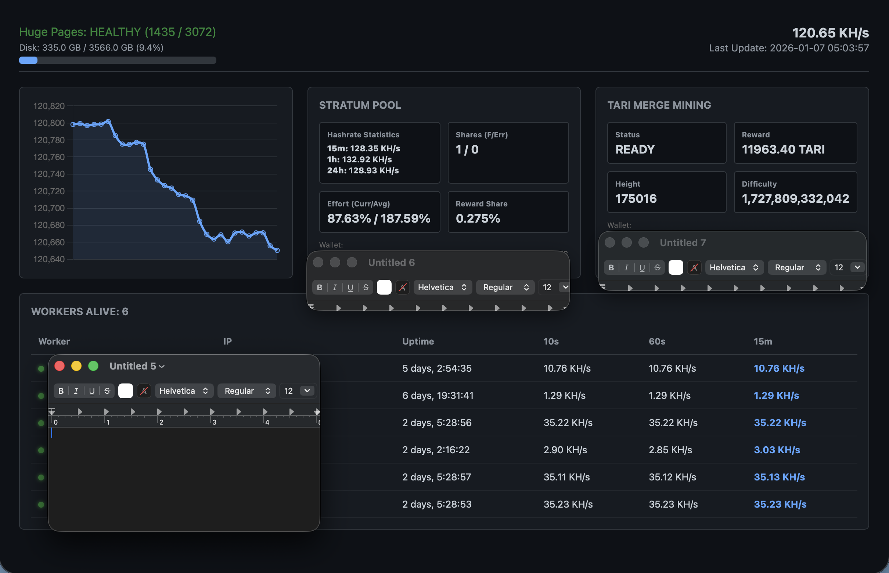

Monero + Tari Merge Mining Docker Stack
=======================================




A high-performance, containerized stack for running a private Monero full node with P2Pool and Tari merge mining. This setup includes a custom monitoring dashboard for real-time visibility into your node and worker health.

⚠️ Disclaimer
-------------

**USE AT YOUR OWN RISK.** This software is provided "as is" without any warranties. Cryptocurrency mining and node operation can be resource-intensive and may expose your hardware or network to risks. Ensure you have properly configured your firewall and understand the implications of running a Tor-bridged node.


🛠️ Components
--------------

*   **Monero Node:** Full daemon with ZMQ enabled for P2Pool.
    
*   **P2Pool:** Decentralized mining pool that gives you full control.
    
*   **Tari Base Node:** Enables merge mining to earn Tari alongside XMR.
    
*   **Tor:** Anonymizes node traffic for enhanced privacy.
    
*   **Dashboard:** A custom UI monitoring hashrate, shares, and worker status.
    

🚀 Quick Setup
--------------

0. **Pre-Requisites** Install Ubuntu Server 24.04 and [Docker Engine](https://docs.docker.com/engine/install/ubuntu/)

1.  **Configure huge pages** Huges pages ensures your P2Pool is able to process your worker shares as fast as possible
```bash
sudo sysctl -w vm.nr_hugepages=3072
```
    
2.  **Clone and Edit:** Clone this repository and update the config.json file with your **XMR Wallet Address**, **Monero Node Username**, **Monero Node Password** and **Tari Wallet Address**. 

_Note: avoid special characters in Monero node username and password, they may conflict with os or application environments._

```bash
git clone https://github.com/VijitSingh97/p2pool-starter-stack.git
cd p2pool-starter-stack
nano config.json #enter your values, ctrl-x, y to save it
```
    
3.  **Start Tor First** 
``` bash
mkdir -p data/tor
docker-compose up -d tor
```

4. **Apply Your Config**
```bash
./configure.sh
```

5. **Run P2Pool Starter Stack**
```bash
docker-compose up -d
```
    

📈 Monitoring
-------------

Once deployed and synced, the dashboard provides a "single pane of glass". View at: http://localhost:8000

*   **Hashrate:** Tracks your current network contribution.
    
*   **Worker Health:** See which workers are "Alive" and their individual performance.
    
*   **Blockchain Status:** Monitor sync height and status for Tari.